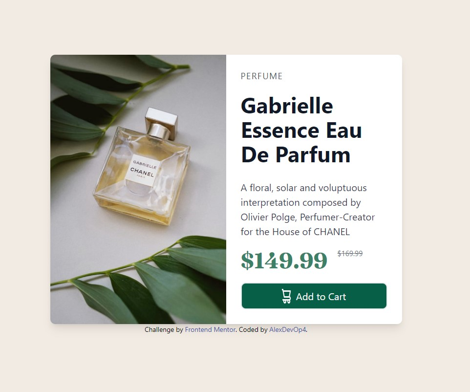
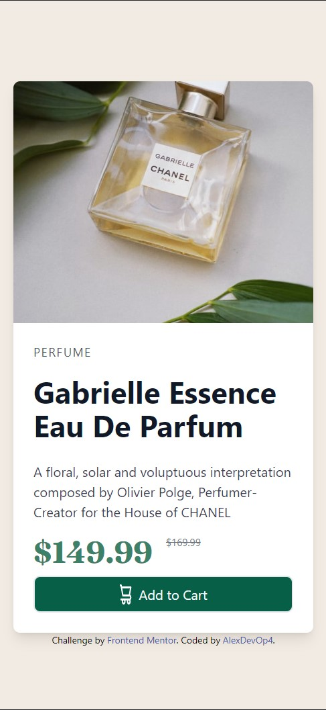

# Frontend Mentor - Product preview card component solution

This is a solution to the [Product preview card component challenge on Frontend Mentor](https://www.frontendmentor.io/challenges/product-preview-card-component-GO7UmttRfa). Frontend Mentor challenges help you improve your coding skills by building realistic projects. 

## Table of contents

- [Overview](#overview)
  - [The challenge](#the-challenge)
  - [Screenshot](#screenshot)
  - [Links](#links)
- [My process](#my-process)
  - [Built with](#built-with)
  - [What I learned](#what-i-learned)
  - [Useful resources](#useful-resources)
- [Author](#author)

**Note: Delete this note and update the table of contents based on what sections you keep.**

## Overview

### The challenge

Users should be able to:

- View the optimal layout depending on their device's screen size
- See hover and focus states for interactive elements

### Screenshot

### Links

- Solution URL: [Add solution URL here](https://your-solution-url.com)
- Live Site URL: [https://monumental-bombolone-d56ef4.netlify.app/](https://monumental-bombolone-d56ef4.netlify.app/)

## My process

Used tailwind css for styling, first started in mobile view and moved to desktop.

### Built with

- Semantic HTML5 markup
- CSS custom properties
- Flexbox
- CSS Grid
- Mobile-first workflow

### What I learned

Biggest thing I learned was positioning and using tailwind css for mobile view, and understanding break points with tailwind.

### Useful resources

- [Tailwind css docs](https://tailwindcss.com/docs/installation)
- [Tailwind Cards component](https://tailwind-elements.com/docs/standard/components/cards/) - This is an amazing article which helped me finally understand card components and making them responsive.

**Note: Delete this note and replace the list above with resources that helped you during the challenge. These could come in handy for anyone viewing your solution or for yourself when you look back on this project in the future.**

## Author

- Frontend Mentor - [@AlexDevOp4](https://www.frontendmentor.io/profile/AlexDevOp4)

# product-preview
